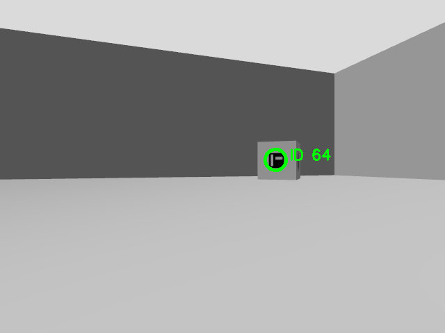
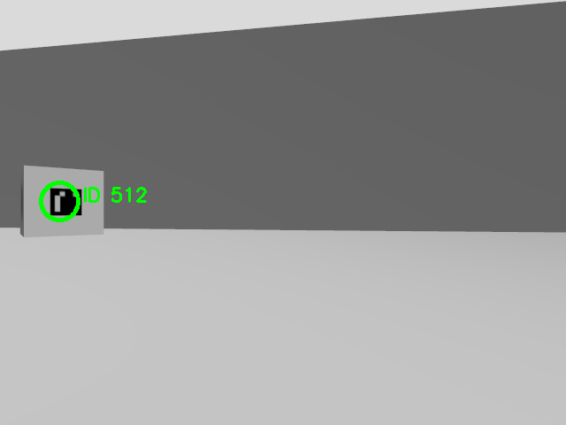

## Overview
The implementation is inside "ws/src/plansys_interface" 
Author/ID: Ahmed_Yousef/6848239 - Maze_Atta/7146206 - Mohamed_Ismail/6655420

Course: Experimental Robotics Laboratorty-University of Genoa

This project develops a ROS 2-based autonomous mobile robot system that detects visual markers in the environment using an onboard camera and executes a task-level plan to visit and process them in order of increasing marker ID. The system is implemented primarily in simulation, using a provided Gazebo world (assignment2.world), and is structured to be extensible to a real robot.

High-level decision making and execution are handled using PlanSys2, which enables symbolic planning over discrete actions such as navigation, marker detection, and image acquisition.

### Video
[Demo](resources/exp2.mp4)

### Screenshots





## Setup

1. To start, make sure that aruco_box folder (the model folder) is in your /home/ubuntu/gazebo_models/

2. Download required packages


```bash
sudo apt update
sudo apt install ros-jazzy-nav2-bringup
sudo apt-get install ros-jazzy-slam-toolbox
sudo apt-get install ros-jazzy-nav2*
sudo apt install ros-jazzy-plansys2-*
```

3. Build the environment with

```bash
colcon build
```

## Running

Run in different terminals:

1. The ros2 planner:

```bash
ros2 launch plansys_interface distributed_actions_assignment.launch.py
```

2. The simulation

```bash
ros2 launch bme_gazebo_sensors spawn_robot.launch.py   world:=simple_world.sdf   rviz_config:=gps.rviz   x:=0 y:=1.0 z:=0.1
```

3. The localization (map is generated)

```bash
ros2 launch ros2_navigation assignment_localization.launch.py
```

4. The navigation server

```bash
ros2 launch ros2_navigation navigation.launch.py
```

5. To start the mission

```bash
ros2 run plansys_interface get_plan_and_execute
```

## Generating the map

Map is already generated but this section is for documentation.


After starting the simulation, start the mapping server:

```bash
ros2 launch ros2_navigation mapping.launch.py
```

Then, start the teleop:

```bash
ros2 run teleop_twist_keyboard teleop_twist_keyboard   --ros-args -r cmd_vel_teleop:=cmd_vel
```

Use the keyboard keys that are going to appear in the terminal to navigate the environment and build the map. 
You can visualize the map in rviz2 too.

Once done, run (inside src/ros2_navigation/maps):

```bash
ros2 run nav2_map_server map_saver_cli -f my_new_map
```